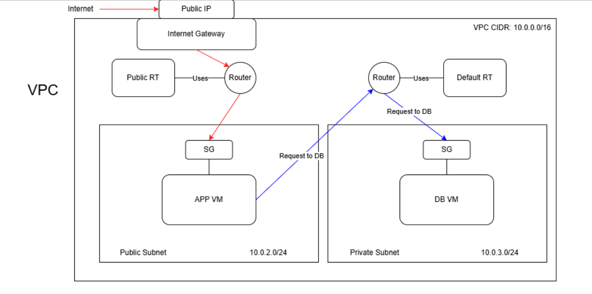
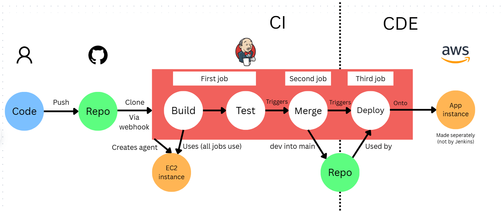

# Week 4 key notes

Topics:

VPCs
Jenkins
CI
CD
CDE
Webhooks
GitHub Actions
etc.

### VPCs

***VPC*** (Virtual private cloud): A private, isolated network within a public cloud infrastructure that allows an organization to isolate and control its own resources and network infrastructure.



Benefits:
- Security
- Flexibility
- Cost efficiency
- Saves time

DevOps:
- Seperate environments
- Consistence
- Containerisation

Components:
- ***Subnets***: You can divide a VPC into subnets to organize and isolate resources based on various requirements
- ***Public vs Private Subnets***
  - ***Public***: Has direct access to the internet via an Internet Gateway (IGW)
  - ***Private***: Isolated from direct internet access. Can communicate with other subnets
- ***[CIDR](https://aws.amazon.com/what-is/cidr/#:~:text=CIDR%20notation%20represents%20an%20IP,bit%20network%20identifier%20as%20192.168.) Blocks*** (Classless Inter-Domain Routing block): 
  - Used to define the range of IP addresses available within a VPC or subnet
  - ***Notation***: 10.0.0.0/16 Each number has 255 possible addresses.
    - 1st number: Network class
    - 2nd: Subnet within the major net
    - 3rd: Smaller subdivision
    - 4th: Specific host on the subnet
    - 5th: Subnet mask: e.g 16 says first 16 bits (2 numbers) are fixed
- ***Internet Gateways***: Allows communication between instances in your VPC and the internet
- ***Route Table/s***: A set of rules (called routes) used to determine where network traffic from your VPC is directed
- ***SG*** (Security group): 
  - Virtual firewalls used to control inbound and outbound traffic to AWS resources. Define which ports are open.

Setup:
- Order: VPC, Subnets, Internet gateway, route tables, Instances
- VPC: 
  - IPv4: 10.0.0.0/16
- Subnets:
  - 1. Public: Availability zone: eu-west-1a, IPv4 Subnet CIDR block: 10.0.2.0/24
  -  2. Private: Availability zone: eu-west-1b, IPv4 Subnet CIDR block: 10.0.3.0/24
- Internet gateway
- Route tables: 
  - Subnet associations: Public
  - Routes:
    - Destination: 0.0.0.0/0
    - Target: Internet gateway
- Instances:
  - DB: 
    - Network settings:
      - Subnet: Private subnet
      - Auto-assign public IP: Disable
      - Security group: Port 27017 (mongoDB)
  - App:
    - Subnet: Public subnet
    - uto-assign public IP: Enable
    - Security group: Port 80 (HTTP)
    - User data

Delete order: 

1) Terminate instances
2) Security groups (Found in the VPC dashboard)
3) VPC

Deleting the VPC will automatically delete:

1) Internet gateways
2) Route tables
3) Subnets

### Github actions

- CICD platform
- Creates a workflow to automatically build and test any new commit you add to github 

Creation:
- New workflow
- Search for the appplication type you are using (e.g. .NET) and select the built and test option
- Produces a YAML file which will be executed when a new commit is made. Adds it to a workflows folder

Example YAML workflow file:
```
name: Node.js CI

on:
  push:
    branches: [ "main" ]
  pull_request:
    branches: [ "main" ]

jobs:
  build:

    runs-on: ubuntu-latest

    strategy:
      matrix:
        node-version: [18.x, 20.x, 22.x]
        # See supported Node.js release schedule at https://nodejs.org/en/about/releases/

    steps:
    - uses: actions/checkout@v4
    - name: Use Node.js ${{ matrix.node-version }}
      uses: actions/setup-node@v4
      with:
        node-version: ${{ matrix.node-version }}
        cache: 'npm'
    - run: npm ci
    - run: npm run build --if-present
    - run: npm test
```

## CICD


CICD pipeline:
1. SCM (Source code management): process for tracking and managing changes to software code
2. Build
3. Test
4. Package
5. Deploy
6. Monitor

**CI/CD**, which stands for continuous integration and continuous delivery/deployment, aims to streamline and accelerate the software development lifecycle.

**Continuous integration** (CI) refers to the practice of automatically and frequently integrating code changes into a shared source code repository. **Continuous delivery** (CD) and/or **deployment** (CDE) is a 2 part process that refers to the integration, testing, and delivery of code changes. Continuous delivery stops short of automatic production deployment, while continuous deployment automatically releases the updates into the production environment.

## Jenkins

Jenkins is widely used to automate tasks that involve repetitive actions.

Advantages:
- CICD tool
- Open source (Lots of plugins and documentation)

Disadvantages:
- Complicated to setup
- Needs a lot of maintanance



